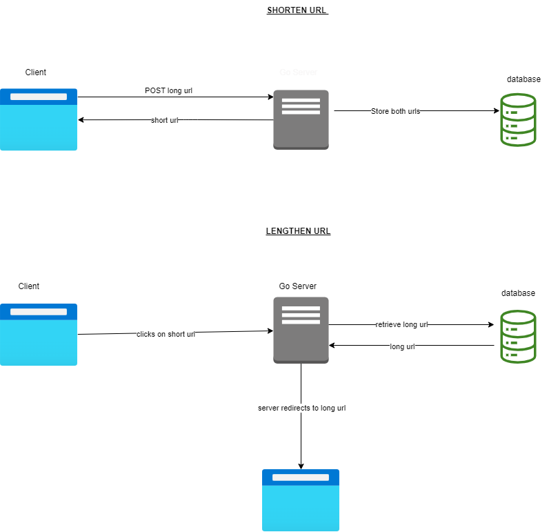

# URL SHORTNER

A simple, fast url shortner server built in GoLang.

## How it works

## Technologies

1. Handlebars - For templating rendering.
2. Fiber - For setting up the server
3. MongoDB - As database
4. GoLang - For backend

## How to use

Create a .env file in the root of the project and add the value your mongodb url as "MONGO_URL"

## Run Server

    go get
    go run cmd/main.go
